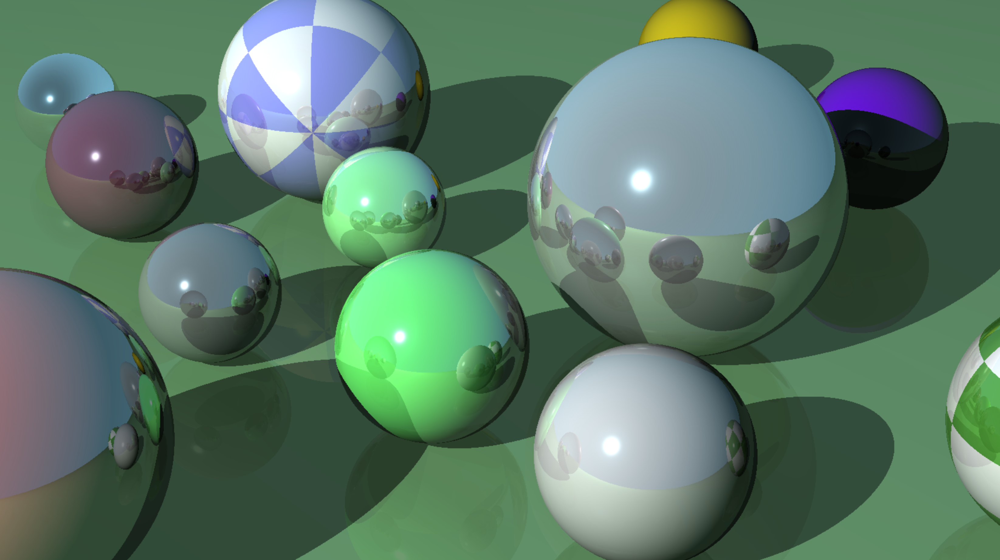
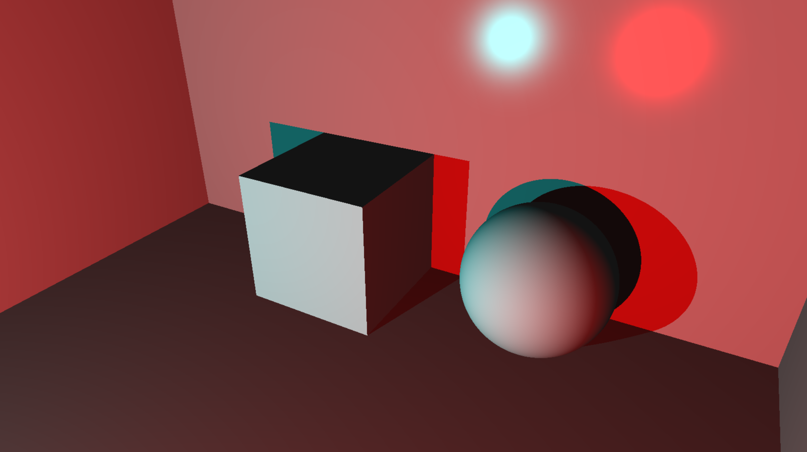

# miniRT - An interactive raytracer
### Real-time interactive raytracer, made from scratch.
Created by [Piolo Polintan](https://github.com/piolows) and [Alexandru Godeanu](https://github.com/pixelabra).



---

## How to use
Depending on your system, you will need the following prerequisites to run the program:
- **Linux**: X11, OpenGL
- **Mac**: OpenGL, Appkit

For Windows, you will need to run within a container (such as WSL) or virtual machine.

Clone this repository, and run `make` inside of it. To run the program, you must use a `.rt` file. Run `./miniRT [.rt file]`.


### Create a world
Create your own world by making a `.rt` file. Populate the file with:
- **Camera**:
  - **Camera** format: C (position vector) (normalized direction vector) (fov)
- **Shapes**:
  - **Sphere** format: sp (position vector) (radius) (rgb values)
  - **Cube** format: cu (position vector) (radius) (rgb values)
  - **Plane** format: pl (arbitrary point vector) (normalized normal vector) (rgb values)
  - **Cylinder** format: cy (position vector) (normalized axis vector) (radius) (height) (rgb values)
  - **Cone** format: co (position vector) (noramlized axis vector) (radius) (height) (rgb values)
- **Lights**:
  - **Ambient light** format: A (intensity ratio from 0 to 1) (rgb values)
  - **Point light** format: L (position vector) (intensity ratio from 0 to 1) (rgb values)

Shapes can modified by adding the following optional properties after their mandatory properties:
- **Diffuse**: df(range from 0 to 1)
- **Ambient**: am(range from 0 to 1)
- **Specular**: sc(range from 0 to 1)
- **Shininess**: sh(range from 1 to 200)
- **Reflectiveness**: rf(range from 0 to 1)
- **Checkers**: ch
- **Scale**: S(scaling vector)
- **Rotation**: R(rotation vector)

Here is an example of a scene:
```plaintext
A 0.1 255,255,255
C 0.0,1.5,0.0 0,0,1 70
L -10,10,-10 1.0 255,255,255
pl 0,0,0 0,1,0 200,200,200 ch S10,1,10
cu -2,1,5 1 100,255,100 df0.2 S1,2,1
sp -1,1,7 2 255,100,100 ch
cy 0,0.5,5 1,0,0 1 2 100,100,255
co 2,1,6 0,1,0 1 2 100,200,255
cu 3,2.5,12 5 100,100,255 re0.75 R0,20,0
```
---

## Features features features!
We aimed to create a **fully dynamic raytracer** that could create phenomenal-looking scenes completely from within the program. You can **add and delete objects**, and **modify every single property** of any object or light from within the program. Press `~` while using the program for the **full manual** to appear on your **terminal**.


We feature a **Camera Mode** and an **Object Mode**, allowing you to position your camera and objects however you like. When in camera mode, you can modify the properties of lights in the scene. When in object mode, you can modify the properties of the selected object. Refer to the manual for controls.

Along with full customizability of your scene from within the program, there are options to make the program run faster, such as toggling **linear interpolation**. We implemented various optimizations like **multithreading** and **SIMD** to make the program smoothly.

---

## Acknowledgments
This project is massive, and we want to thank everyone who helped us along the way!
- Our dear friends [Emran](https://github.com/Pastifier), [Pierce](https://github.com/Monkeycofi), [Aarij](https://github.com/ahaarij), and [Emad](https://github.com/ZaxVaxZ), who have all also done this project and collaborated with us. Together, we make up **42 Abu Dhabi's official _miniRT cult_**.
- [Hasan Sarhan's miniRT](https://github.com/h-sarhan-miniRT), an incredibly well-made miniRT by our senior which inspired and motivated us to push the boundaries of this project.
- [The Raytracer Challenge](http://raytracerchallenge.com). It's really all you need in life.
- Emran again, because this README basically rips off the structure of his. But honestly, his is better.
- My incredible partner [Alex](https://github.com/pixelabra). I couldn't have done with anyone else.

---



